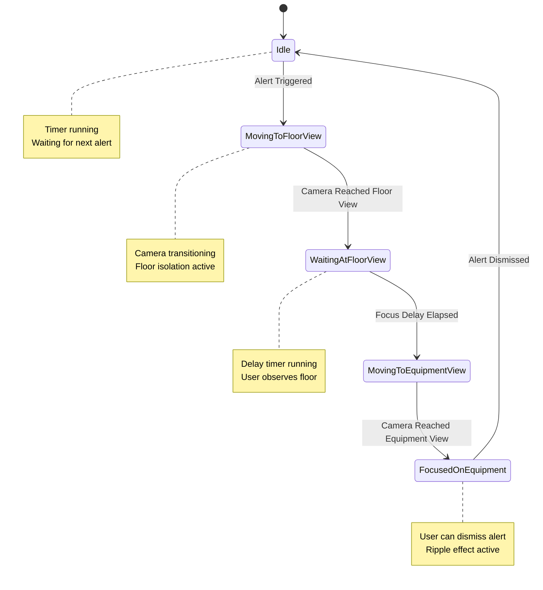

# Design Document: Equipment Alert System

## Overview

设备警报系统是一个自动化的警报管理系统，用于在Unity场景中模拟设备故障场景。系统通过随机触发设备警报，使用红色波纹视觉效果标识报警设备，并通过两阶段摄像头聚焦（楼层预设视角→设备聚焦视角）引导用户注意力。同时，系统会隔离显示报警设备所在楼层，隐藏其他楼层以提供清晰视野。

### Key Design Goals

1. **自动化警报触发**: 基于可配置的时间间隔随机选择设备触发警报
2. **清晰的视觉反馈**: 使用红色波纹效果明确标识报警设备
3. **渐进式视角引导**: 先展示楼层全景，再聚焦到具体设备，提供良好的空间感知
4. **无干扰的视野**: 通过楼层隔离确保用户能清楚看到报警设备
5. **与现有系统集成**: 复用FloorController和CameraController，保持系统一致性

### System Context

该系统将集成到现有的House场景中，与以下组件协同工作：
- **FloorController**: 负责楼层显示/隐藏和摄像头位置管理
- **CameraController**: 负责摄像头的用户控制（移动、旋转）
- **SelectionRipple**: 提供波纹视觉效果的基础实现

## Architecture

### Component Overview

系统采用单一管理器模式，由AlertSystem作为核心控制器，协调各个子系统的工作。

```
┌─────────────────────────────────────────────────────────────┐
│                        AlertSystem                          │
│  ┌──────────────┐  ┌──────────────┐  ┌──────────────┐     │
│  │ Alert Timer  │  │ State Machine│  │ Equipment    │     │
│  │              │  │              │  │ Registry     │     │
│  └──────────────┘  └──────────────┘  └──────────────┘     │
└─────────────────────────────────────────────────────────────┘
           │                  │                  │
           ▼                  ▼                  ▼
    ┌─────────────┐   ┌─────────────┐   ┌─────────────┐
    │   Timer     │   │   Camera    │   │   Floor     │
    │  Subsystem  │   │  Subsystem  │   │  Subsystem  │
    └─────────────┘   └─────────────┘   └─────────────┘
           │                  │                  │
           │                  ▼                  ▼
           │          ┌──────────────┐   ┌──────────────┐
           │          │Camera        │   │Floor         │
           │          │Controller    │   │Controller    │
           │          └──────────────┘   └──────────────┘
           │
           ▼
    ┌─────────────┐
    │  Equipment  │
    │  + Ripple   │
    └─────────────┘
```

### State Machine Design

警报系统使用状态机管理警报序列的生命周期：



### Subsystem Responsibilities

#### Timer Subsystem
- 管理警报触发间隔计时
- 在Idle状态下触发新警报
- 支持可配置的时间间隔范围（5-300秒）

#### Camera Subsystem
- 计算楼层预设视角和设备聚焦视角
- 控制摄像头平滑过渡
- 管理CameraController的启用/禁用状态
- 保存和恢复用户摄像头位置

#### Floor Subsystem
- 管理设备注册和楼层分组
- 随机选择报警设备
- 协调FloorController进行楼层隔离
- 管理波纹效果的创建和销毁

## Components and Interfaces

### AlertSystem (MonoBehaviour)

核心管理器组件，负责整个警报系统的协调和控制。

#### Public Configuration

```csharp
[Header("Alert Timing")]
public float minAlertInterval = 10f;      // 最小警报间隔（秒）
public float maxAlertInterval = 60f;      // 最大警报间隔（秒）
public float focusDelayDuration = 2f;     // 楼层视角停留时间（秒）

[Header("Camera Transition")]
public float cameraTransitionTime = 1f;   // 摄像头过渡时间（秒）
public float equipmentFocusDistance = 5f; // 设备聚焦距离

[Header("Ripple Effect")]
public Color alertRippleColor = Color.red; // 警报波纹颜色
public float rippleSize = 2f;              // 波纹大小
public float rippleAlpha = 0.6f;           // 波纹透明度

[Header("Equipment Identification")]
public string equipmentTag = "Equipment";  // 设备标签
```

#### Public Methods

```csharp
// 启动警报系统
public void StartAlertSystem()

// 停止警报系统
public void StopAlertSystem()

// 手动触发警报（用于测试）
public void TriggerAlertManually(GameObject equipment)

// 解除当前警报
public void DismissCurrentAlert()

// 查询当前状态
public AlertState GetCurrentState()

// 查询当前报警设备
public GameObject GetCurrentAlertEquipment()
```

#### Private Methods

```csharp
// 初始化系统
private void Initialize()

// 发现并注册所有设备
private void DiscoverEquipment()

// 随机选择设备触发警报
private void TriggerRandomAlert()

// 开始警报序列
private void StartAlertSequence(GameObject equipment)

// 计算楼层预设视角
private CameraView CalculateFloorPresetView(string floorName)

// 计算设备聚焦视角
private CameraView CalculateEquipmentFocusView(GameObject equipment)

// 创建波纹效果
private void CreateRippleEffect(GameObject equipment)

// 销毁波纹效果
private void DestroyRippleEffect()

// 状态转换
private void TransitionToState(AlertState newState)
```

### AlertState (Enum)

```csharp
public enum AlertState
{
    Idle,                    // 空闲状态，等待触发
    MovingToFloorView,       // 移动到楼层视角
    WaitingAtFloorView,      // 在楼层视角等待
    MovingToEquipmentView,   // 移动到设备视角
    FocusedOnEquipment       // 聚焦在设备上
}
```

### CameraView (Struct)

```csharp
public struct CameraView
{
    public Vector3 position;    // 摄像头位置
    public Quaternion rotation; // 摄像头旋转
    
    public CameraView(Vector3 pos, Quaternion rot)
    {
        position = pos;
        rotation = rot;
    }
}
```

### EquipmentInfo (Class)

```csharp
private class EquipmentInfo
{
    public GameObject gameObject;  // 设备GameObject
    public string floorName;       // 所属楼层名称
    public bool isAlerting;        // 是否正在报警
    
    public EquipmentInfo(GameObject obj, string floor)
    {
        gameObject = obj;
        floorName = floor;
        isAlerting = false;
    }
}
```

### Integration Interfaces

#### FloorController Integration

AlertSystem将调用FloorController的以下方法：
- `EnterIsolationMode(string floorName)`: 进入楼层隔离模式
- `ExitIsolationMode()`: 退出楼层隔离模式
- `IsInIsolationMode()`: 查询是否在隔离模式

#### CameraController Integration

AlertSystem将直接控制Camera的transform，并管理CameraController的enabled状态：
- 禁用CameraController以阻止用户输入
- 使用协程平滑移动摄像头
- 警报结束后重新启用CameraController

#### SelectionRipple Integration

AlertSystem将实例化SelectionRipple组件并调用：
- `Initialize(Color color, float size, Material material)`: 初始化波纹效果

## Data Models

### Equipment Registry

设备注册表使用Dictionary存储设备信息，按楼层分组：

```csharp
private Dictionary<string, List<EquipmentInfo>> equipmentByFloor;
private List<EquipmentInfo> allEquipment;
```

数据结构设计考虑：
- 按楼层分组便于快速查找同楼层设备
- 全局列表便于随机选择
- EquipmentInfo封装设备状态，避免直接修改GameObject

### Alert Sequence State

警报序列状态数据：

```csharp
private AlertState currentState = AlertState.Idle;
private GameObject currentAlertEquipment = null;
private GameObject currentRippleObject = null;
private string currentAlertFloor = null;
private CameraView savedCameraView;
```

### Timer State

计时器状态数据：

```csharp
private float alertTimer = 0f;
private float nextAlertTime = 0f;
private float focusDelayTimer = 0f;
private bool isSystemActive = false;
```

### Camera Transition State

摄像头过渡状态（用于协程）：

```csharp
private Coroutine currentCameraTransition = null;
private bool isCameraTransitioning = false;
```

### Floor Preset Views

楼层预设视角配置（可选，如果未配置则自动计算）：

```csharp
[System.Serializable]
public class FloorPresetView
{
    public string floorName;
    public Vector3 position;
    public Vector3 rotation;
}

[Header("Floor Preset Views (Optional)")]
public List<FloorPresetView> floorPresetViews = new List<FloorPresetView>();
```


## Correctness Properties

*A property is a characteristic or behavior that should hold true across all valid executions of a system-essentially, a formal statement about what the system should do. Properties serve as the bridge between human-readable specifications and machine-verifiable correctness guarantees.*

### Property 1: Equipment Registry Completeness

*For any* scene configuration with equipment objects, after initialization, the alert system's equipment registry should contain all and only those GameObjects that have the equipment tag or marker.

**Validates: Requirements 1.1**

### Property 2: Alert Interval Bounds

*For any* configured alert interval value, the system should accept values within [5, 300] seconds and reject values outside this range.

**Validates: Requirements 1.5**

### Property 3: Single Active Alert Invariant

*For any* sequence of alert triggers, at any point in time, at most one equipment should be in alert state.

**Validates: Requirements 1.4**

### Property 4: Alert State Activation

*For any* equipment in the registry, when it is selected for alert, its alert state should transition to active.

**Validates: Requirements 1.3**

### Property 5: Ripple Creation on Alert

*For any* equipment entering alert state, a ripple effect should be created and attached to that equipment.

**Validates: Requirements 2.1**

### Property 6: Ripple Color Configuration

*For any* created ripple effect, its color should match the configured alert ripple color with the configured alpha transparency.

**Validates: Requirements 2.2**

### Property 7: Ripple Position Alignment

*For any* equipment with an active ripple effect, the ripple's position should match the equipment's center point.

**Validates: Requirements 2.4**

### Property 8: Ripple Cleanup on Dismissal

*For any* equipment exiting alert state, its associated ripple effect should be destroyed.

**Validates: Requirements 2.6, 6.3**

### Property 9: Floor Identification

*For any* equipment in the scene hierarchy, the system should correctly identify its parent floor by traversing the GameObject hierarchy.

**Validates: Requirements 3.1**

### Property 10: Camera Transition Timing

*For any* camera transition (to floor view or equipment view), the transition should complete within the configured transition time (1 second).

**Validates: Requirements 3.4, 4.5**

### Property 11: Focus Delay Bounds

*For any* configured focus delay value, the system should accept values within [1, 10] seconds and reject values outside this range.

**Validates: Requirements 4.2**

### Property 12: Equipment Focus View Calculation

*For any* equipment, the calculated equipment focus view should position the camera at the configured focus distance from the equipment with the equipment visible in the camera's view frustum.

**Validates: Requirements 4.6**

### Property 13: Floor Isolation Activation

*For any* alert sequence, when camera movement to floor view begins, the floor controller should enter isolation mode for the target floor.

**Validates: Requirements 5.1**

### Property 14: Floor Visibility in Isolation

*For any* floor in isolation mode, only the target floor should be visible and all other floors (including roof) should be hidden.

**Validates: Requirements 5.2, 5.3**

### Property 15: Isolation Mode Persistence

*For any* active alert, the floor isolation mode should remain active until the alert is dismissed.

**Validates: Requirements 5.4**

### Property 16: Isolation Mode Exit on Dismissal

*For any* alert dismissal, the floor controller should exit isolation mode and restore visibility of all floors and roof.

**Validates: Requirements 5.5, 5.6**

### Property 17: Alert State Deactivation on Dismissal

*For any* equipment in alert state, when the alert is dismissed, the equipment's alert state should transition to inactive.

**Validates: Requirements 6.2**

### Property 18: Camera Control Restoration

*For any* alert dismissal, the camera controller's user input handling should be re-enabled.

**Validates: Requirements 6.5**

### Property 19: Timer Reset on Dismissal

*For any* alert dismissal, the alert interval timer should be reset to begin counting toward the next alert.

**Validates: Requirements 6.6**

### Property 20: Floor Equipment Validation

*For any* floor in the scene, if it contains no equipment objects, the system should log a warning during initialization.

**Validates: Requirements 7.3**

### Property 21: Missing Dependency Handling

*For any* initialization where FloorController or CameraController is not found, the system should log an error and disable alert functionality.

**Validates: Requirements 7.5**

### Property 22: Camera Control Disabled During Movement

*For any* alert sequence, when camera movement begins, the camera controller's user input handling should be disabled.

**Validates: Requirements 8.1**

### Property 23: Camera State Preservation

*For any* alert sequence, before taking camera control, the system should save the current camera position and rotation.

**Validates: Requirements 8.2**

### Property 24: Camera Control Non-Interference in Idle

*For any* time when the alert system is in idle state, the camera controller should remain enabled and responsive to user input.

**Validates: Requirements 8.4**

### Property 25: Programmatic Camera Control

*For any* camera movement command from the alert system, the camera should respond and move even when user input is disabled.

**Validates: Requirements 8.5**

### Property 26: Equipment Identification by Tag

*For any* GameObject with the equipment tag or marker, the system should identify it as equipment during discovery.

**Validates: Requirements 9.1**

### Property 27: Equipment Grouping by Floor

*For any* set of equipment objects, the system should group them by their parent floor, with equipment on the same floor in the same group.

**Validates: Requirements 9.3**

### Property 28: Invalid Hierarchy Handling

*For any* equipment object not under a floor object in the hierarchy, the system should log a warning and exclude it from the alert registry.

**Validates: Requirements 9.4**

### Property 29: Dynamic Equipment Registry Updates

*For any* equipment object added or removed during runtime, the equipment registry should update to reflect the change.

**Validates: Requirements 9.5**

### Property 30: State Transition Sequence Enforcement

*For any* state transition request, the system should only allow transitions that follow the defined sequence: Idle → MovingToFloorView → WaitingAtFloorView → MovingToEquipmentView → FocusedOnEquipment → Idle.

**Validates: Requirements 10.2**

### Property 31: Alert Triggering in Idle State

*For any* alert trigger request when the system is in idle state, the system should accept and process the trigger.

**Validates: Requirements 10.3**

### Property 32: Alert Queuing in Non-Idle State

*For any* alert trigger request when the system is not in idle state, the system should queue or ignore the trigger.

**Validates: Requirements 10.4**

### Property 33: Return to Idle on Dismissal

*For any* alert dismissal or completion, the system should transition back to idle state.

**Validates: Requirements 10.5**

## Error Handling

### Initialization Errors

1. **Missing Dependencies**
   - Error: FloorController or CameraController not found
   - Handling: Log error, disable alert functionality, prevent system start
   - Recovery: None - requires scene setup correction

2. **No Equipment Found**
   - Error: No equipment objects discovered in scene
   - Handling: Log warning, disable alert functionality
   - Recovery: None - requires adding equipment to scene

3. **Equipment Without Floor**
   - Error: Equipment object not under a floor in hierarchy
   - Handling: Log warning, exclude from registry, continue with valid equipment
   - Recovery: Partial - system works with remaining valid equipment

### Runtime Errors

1. **Equipment Destroyed During Alert**
   - Error: Current alert equipment is destroyed
   - Handling: Dismiss current alert, clean up ripple, return to idle
   - Recovery: Full - system continues with remaining equipment

2. **Camera Transition Interrupted**
   - Error: Camera transition coroutine stopped unexpectedly
   - Handling: Log error, restore camera control, return to idle
   - Recovery: Full - system resets to safe state

3. **Floor Controller State Mismatch**
   - Error: Floor controller isolation state doesn't match expected state
   - Handling: Force exit isolation mode, log warning
   - Recovery: Full - system synchronizes state

### Configuration Errors

1. **Invalid Alert Interval**
   - Error: Configured interval outside [5, 300] range
   - Handling: Clamp to valid range, log warning
   - Recovery: Full - use clamped value

2. **Invalid Focus Delay**
   - Error: Configured delay outside [1, 10] range
   - Handling: Clamp to valid range, log warning
   - Recovery: Full - use clamped value

3. **Invalid Camera Transition Time**
   - Error: Transition time <= 0
   - Handling: Use default value (1 second), log warning
   - Recovery: Full - use default value

### State Machine Errors

1. **Invalid State Transition**
   - Error: Attempt to transition to invalid next state
   - Handling: Log error, ignore transition, maintain current state
   - Recovery: Full - state machine remains consistent

2. **State Timeout**
   - Error: System stuck in non-idle state for too long
   - Handling: Force return to idle, clean up resources, log error
   - Recovery: Full - system resets with timeout mechanism

## Testing Strategy

### Unit Testing Approach

Unit tests will focus on specific behaviors, edge cases, and integration points:

1. **Initialization Tests**
   - Test equipment discovery with various scene configurations
   - Test dependency resolution (FloorController, CameraController)
   - Test configuration validation and clamping
   - Test floor grouping logic

2. **State Machine Tests**
   - Test each state transition in the sequence
   - Test invalid transition rejection
   - Test state query methods
   - Test timeout and recovery mechanisms

3. **Camera Control Tests**
   - Test camera view calculations (floor preset, equipment focus)
   - Test camera control enable/disable
   - Test camera state preservation and restoration
   - Test transition timing

4. **Floor Isolation Tests**
   - Test isolation mode activation/deactivation
   - Test floor visibility toggling
   - Test roof visibility handling

5. **Ripple Effect Tests**
   - Test ripple creation and destruction
   - Test ripple positioning and scaling
   - Test ripple color configuration

6. **Error Handling Tests**
   - Test missing dependency handling
   - Test invalid configuration handling
   - Test runtime error recovery

### Property-Based Testing Approach

Property-based tests will verify universal properties across all inputs using a PBT library. For C#/Unity, we will use **NUnit with FsCheck** or **Hedgehog** for property-based testing.

**Configuration:**
- Minimum 100 iterations per property test
- Each test tagged with: `Feature: equipment-alert-system, Property {number}: {property_text}`

**Property Test Categories:**

1. **Registry Properties** (Properties 1, 26, 27, 28, 29)
   - Generate random scene configurations with varying equipment counts and hierarchies
   - Verify registry completeness and correctness
   - Test dynamic updates

2. **Configuration Properties** (Properties 2, 11)
   - Generate random configuration values
   - Verify bounds checking and clamping

3. **State Invariants** (Properties 3, 30, 31, 32, 33)
   - Generate random sequences of alert triggers and dismissals
   - Verify state machine constraints hold
   - Verify single active alert invariant

4. **Alert Lifecycle Properties** (Properties 4, 5, 8, 17)
   - Generate random equipment selections
   - Verify complete alert lifecycle (activation → ripple creation → dismissal → cleanup)

5. **Camera Properties** (Properties 10, 12, 22, 23, 24, 25)
   - Generate random equipment positions and camera states
   - Verify camera calculations and transitions
   - Verify control state management

6. **Floor Isolation Properties** (Properties 9, 13, 14, 15, 16)
   - Generate random floor configurations
   - Verify isolation behavior and visibility states

7. **Visual Effect Properties** (Properties 6, 7)
   - Generate random ripple configurations
   - Verify ripple properties match specifications

### Integration Testing

Integration tests will verify the system works correctly with real Unity components:

1. **Full Alert Sequence Test**
   - Set up complete scene with floors and equipment
   - Trigger alert and verify entire sequence executes correctly
   - Verify camera movement, floor isolation, and ripple effects

2. **Multi-Alert Test**
   - Trigger multiple alerts in sequence
   - Verify proper cleanup between alerts
   - Verify timer reset and next alert triggering

3. **User Interaction Test**
   - Trigger alert and test manual dismissal
   - Verify camera control restoration
   - Verify user can resume normal camera control

4. **Performance Test**
   - Test with large numbers of equipment (100+)
   - Verify alert triggering performance
   - Verify no memory leaks from ripple creation/destruction

### Test Execution

- Unit tests: Run in Unity Test Runner (Edit Mode)
- Property tests: Run in Unity Test Runner with FsCheck integration
- Integration tests: Run in Unity Test Runner (Play Mode)
- Performance tests: Run in standalone builds with profiling

### Coverage Goals

- Code coverage: >90% for AlertSystem core logic
- Property coverage: All 33 properties implemented as tests
- Edge case coverage: All error handling paths tested
- Integration coverage: All component interactions tested

